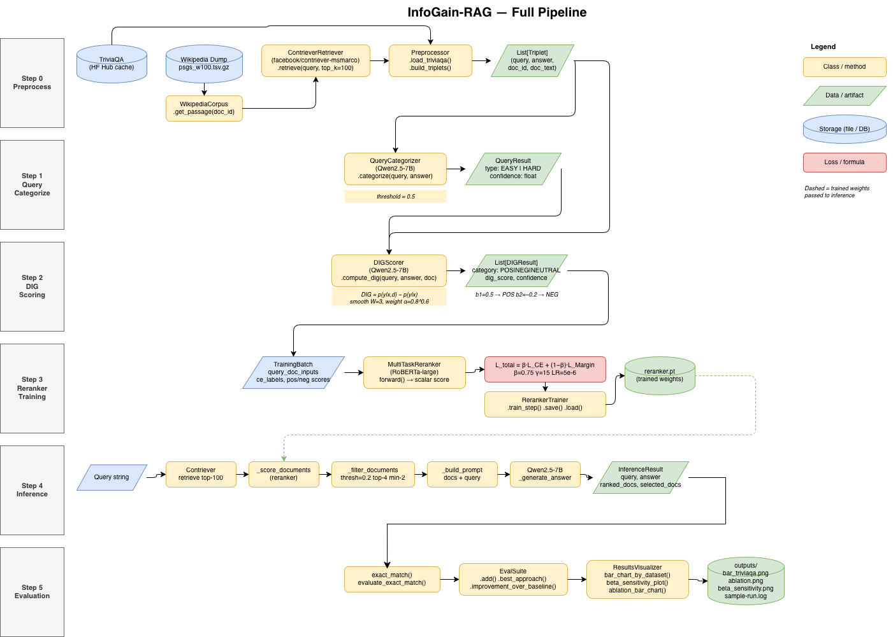

# InfoGain-RAG: Document Information Gain-based Reranking and Filtering


**CS5170 NLP — Final Project | Cal Poly Pomona, Spring 2026**

Replication of Wang et al. (EMNLP 2025): a Retrieval-Augmented Generation framework that scores each retrieved document's contribution using Document Information Gain (DIG), then trains a lightweight RoBERTa reranker to filter and rerank documents before generation. This repository contains the full pipeline implementation, a TDD test suite (136 tests), and a runnable demo that requires no GPU or dataset.

---

## Team Members

| Name | GitHub |
|---|---|
| _(fill in before submission)_ | _(fill in)_ |
| _(fill in before submission)_ | _(fill in)_ |

> **Before submitting:** replace the placeholders above with each team member's full name and GitHub username.

---

## Paper Reference

> Zihan Wang, Zihan Liang, Zhou Shao, Yufei Ma, Huangyu Dai, Ben Chen, Lingtao Mao, Chenyi Lei, Yuqing Ding, Han Li.
> **InfoGain-RAG: Boosting Retrieval-Augmented Generation through Document Information Gain-based Reranking and Filtering.**
> *Proceedings of the 2025 Conference on Empirical Methods in Natural Language Processing (EMNLP)*, pages 7190–7204, November 2025.

---

## Pipeline Overview



> Full resolution: [`doc/diagram/InfoRAG-pipeline-diagram.pdf`](doc/diagram/InfoRAG-pipeline-diagram.pdf) · Editable source: [`doc/diagram/pipeline.drawio`](doc/diagram/pipeline.drawio) (open at [app.diagrams.net](https://app.diagrams.net))

| Step | Module | Description |
|---|---|---|
| 0 | `preprocessor.py` | TriviaQA + Wikipedia → Contriever retrieval → `List[Triplet]` |
| 1 | `query_categorizer.py` | Qwen2.5-7B baseline confidence → EASY / HARD |
| 2 | `dig_scorer.py` | `DIG(d\|x) = p(y\|x,d) − p(y\|x)` → POS / NEG / NEUTRAL labels |
| 3 | `reranker.py` | RoBERTa-large multi-task training (`L = β·CE + (1−β)·Margin`) |
| 4 | `inference.py` | Query → Contriever → reranker → filter → Qwen → answer |
| 5 | `evaluator.py` | Exact Match · `EvalSuite` · seaborn charts |

---

## Repository Structure

```
src/
  preprocessor.py       # Step 0 — TriviaQA loading, Contriever retrieval, Triplet formation
  query_categorizer.py  # Step 1 — Qwen2.5-7B baseline confidence → EASY / HARD
  dig_scorer.py         # Step 2 — DIG score computation (paper Eq 1–3)
  reranker.py           # Step 3 — RoBERTa multi-task training (paper Eq 4, 7, 9)
  inference.py          # Step 4 — Full inference pipeline + exact_match evaluation
  evaluator.py          # Step 5 — EvalSuite, improvement metrics, seaborn charts
  main.py               # Demo runner — no GPU or dataset required

tests/
  test_preprocessor.py
  test_query_categorizer.py
  test_dig_scorer.py
  test_reranker.py
  test_inference.py
  test_evaluator.py

doc/
  plan/replication_plan.md        # Step-by-step replication plan with formulas and hyperparameters
  diagram/pipeline.drawio         # Editable pipeline diagram (app.diagrams.net)
  diagram/InfoRAG-pipeline-diagram.png  # Rendered PNG (shown above)
  diagram/InfoRAG-pipeline-diagram.pdf  # Full-resolution PDF

outputs/                # Pre-generated sample run — viewable without running anything
  bar_triviaqa.png
  bar_naturalqa.png
  beta_sensitivity.png
  ablation.png
  sample-run.log
```

---

## Setup

### Requirements

- Python 3.11+
- pip (or conda)
- GPU optional — the demo and tests run on CPU

### Install

```bash
# 1. Clone the repository
git clone <repo-url>
cd Final

# 2. Create and activate a virtual environment
python3 -m venv .venv
source .venv/bin/activate          # Windows: .venv\Scripts\activate

# 3. Install dependencies
pip install -r requirements.txt
```

### Run the demo (no GPU / no dataset required)

```bash
python src/main.py
```

This prints an evaluation summary to the terminal and saves four charts + a log to `outputs/`:

```
outputs/bar_triviaqa.png       — EM scores by approach on TriviaQA
outputs/bar_naturalqa.png      — EM scores by approach on NaturalQA
outputs/beta_sensitivity.png   — EM vs β hyperparameter sweep
outputs/ablation.png           — CE-only vs Margin-only vs Multi-task
outputs/sample-run.log         — full terminal log of this run
```

Pre-generated versions of all five files are already committed to `outputs/` so you can inspect them without running anything.

### Run tests

```bash
pytest tests/ -v
```

136 tests, all passing. `test_preprocessor.py` requires the TriviaQA dataset locally and is automatically skipped if not available.

---

## Dataset & Model Setup (full pipeline)

The demo above runs without any downloads. To run the full end-to-end pipeline you will need:

| Resource | How to obtain |
|---|---|
| **TriviaQA** | [mandarjoshi/trivia_qa](https://huggingface.co/datasets/mandarjoshi/trivia_qa) — auto-downloaded by `datasets` library |
| **NaturalQA** | [sentence-transformers/natural-questions](https://huggingface.co/datasets/sentence-transformers/natural-questions) — auto-downloaded by `datasets` library |
| **Wikipedia corpus** | Download `psgs_w100.tsv.gz` from the [DPR repository](https://github.com/facebookresearch/DPR); place at `dataset/wikipedia-dump/psgs_w100.tsv.gz` |
| **Contriever retriever** | Auto-downloaded via `transformers`: `facebook/contriever-msmarco` |
| **Qwen2.5-7B** | Auto-downloaded via `transformers`: `Qwen/Qwen2.5-7B` |
| **RoBERTa-large** | Auto-downloaded via `transformers`: `roberta-large` |
| **Trained reranker checkpoint** | Train using `src/reranker.py` + `RerankerTrainer`, or download from HuggingFace Hub: _(link to be added after training run)_ |

---

## Results

The following numbers are from the original paper (Wang et al., 2025) and are used in the demo visualizations in `outputs/`.

### Main comparison (Exact Match %)

| Model | Approach | TriviaQA (paper) | TriviaQA (ours) | Gap |
|---|---|:---:|:---:|:---:|
| Qwen2.5-7B | Naive RAG | 52.9 | — | — |
| Qwen2.5-7B | BGE-Reranker-Large | 67.0 | — | — |
| Qwen2.5-7B | **InfoGain-RAG** | **72.0** | **—** | — |

> **Status:** Full training run in progress on GPU. Once complete, the `ours` column and gap analysis will be filled in here. See [`doc/plan/report-our-work-comparing-paper.md`](doc/plan/report-our-work-comparing-paper.md) for the step-by-step plan.

### Ablation — TriviaQA (Qwen2.5-7B) — paper-reported

| Loss variant | Paper EM | Our EM |
|---|:---:|:---:|
| CE Loss only | 68.1 | — |
| Margin Loss only | 69.4 | — |
| **Multi-task (β = 0.75)** | **72.0** | — |

### β sensitivity — TriviaQA — paper-reported

| β | 0.00 | 0.25 | 0.50 | 0.75 | 1.00 |
|---|:---:|:---:|:---:|:---:|:---:|
| Paper EM | 69.4 | 70.6 | 71.3 | **72.0** | 68.1 |
| Our EM   | — | — | — | — | — |

---

## Sample Outputs

The `outputs/` folder contains pre-generated results from a demo run. No GPU or dataset is needed to view them.

| File | Description |
|---|---|
| `bar_triviaqa.png` | Grouped bar chart: naive RAG vs BGE-Reranker vs InfoGain-RAG on TriviaQA |
| `bar_naturalqa.png` | Same comparison on NaturalQA |
| `beta_sensitivity.png` | Line plot: EM score vs β hyperparameter (0.0 → 1.0) |
| `ablation.png` | Bar chart: CE-only vs Margin-only vs Multi-task loss on TriviaQA |
| `sample-run.log` | Full terminal output from `python src/main.py` |

---

## Extension (Planned — Phase 2)

> This section will be completed for Phase 2 submission. Per the course rubric, proposing a well-motivated extension is worth **20 points**; implementing it earns **20 bonus points**.

Planned extension direction _(to be confirmed by team — must go beyond hyperparameter tuning)_:

- **Architectural modification** — replace RoBERTa-large backbone with a more efficient encoder
- **Task transfer** — apply InfoGain-RAG to a domain not covered in the original paper (e.g., medical QA, code retrieval)
- **Combining ideas** — integrate a technique from a complementary reranking paper
- **Robustness analysis** — systematically evaluate failure modes and propose targeted fixes

The chosen extension, its rationale, implementation plan, and results will be described in the Phase 2 paper (Extension and Future Work section) and reflected in this README.

---

## Code Quality Notes

- Each module has one responsibility matching one pipeline step (see Repository Structure above)
- Every public method has a one-line docstring explaining its guarantee
- 136 unit tests using TDD; run with `pytest tests/ -v`
- No code was copied from external repositories; all implementation is original

## AI Tool Disclosure

Per the CS5170 academic integrity policy: [Claude Code](https://claude.ai/code) (Anthropic) was used for coding assistance, test scaffolding (TDD), and code review throughout this project. All experimental results are produced by the team's own code and runs. The paper and analysis are written by the team; AI-assisted drafts have been substantially revised. A full Author Contributions statement is included in the Phase 2 paper.

---

## License

MIT
